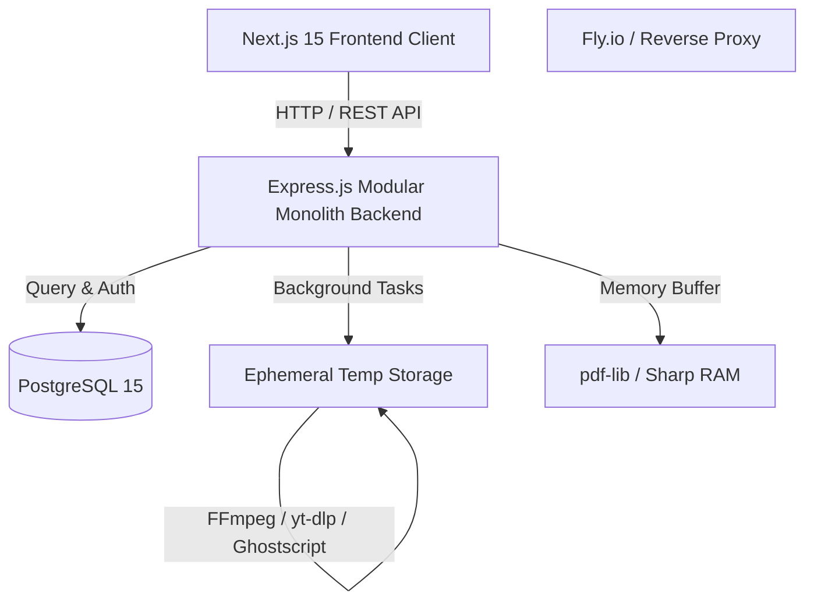

# 🛠️ Inst Sons (Personal Productivity & Utility Suite)

<div align="center">


<p align="center">
  <b>Inst Sons</b> (dari kata <i>instrumenta personalia</i>) adalah aplikasi web utilitas all-in-one berbasis <b>Modular Monolith</b> yang menyediakan berbagai perkakas digital untuk memproses dokumen PDF, kompresi/konversi gambar, ekstraksi audio YouTube, dan manipulasi format audio dengan aman, cepat, dan efisien.
</p>

[✨ Fitur Utama](#-fitur-utama) •
[🏗️ Arsitektur & Tech Stack](#-arsitektur--tech-stack) •
[🚀 Panduan Instalasi & Docker](#-panduan-instalasi--menjalankan-aplikasi) •
[📡 Dokumentasi Endpoint API](#-dokumentasi-endpoint-api) •
[🧪 Testing & Pengujian](#-testing--pengujian) •
[📁 Struktur Proyek](#-struktur-direktori)

---

</div>

## 🌟 Ringkasan Proyek

**Inst Sons** dirancang dengan filosofi performa tinggi dan efisiensi resource:
- **In-Memory Buffer Processing**: Pemrosesan file cepat tanpa menulis ke disk untuk modul PDF & Citra Gambar (RAM based).
- **Asynchronous Task & Polling**: Penanganan tugas berat (seperti unduh audio YouTube dan konversi audio FFmpeg) secara latar belakang (background worker) dengan pelacakan status tugas real-time.
- **Ephemeral Storage Auto-Cleanup**: Penghapusan file sementara (`/backend/temp`) secara otomatis setelah file berhasil diunduh klien guna menjaga integritas ruang penyimpanan server.
- **Modern Dark Aesthetic**: Tampilan antarmuka frontend yang modern, responsif, dan kaya umpan balik visual berbasis Next.js App Router dan Tailwind CSS.

---

## ✨ Fitur Utama

### 1. 📄 PDF Tools Suite (`/pdf`)
Solusi komprehensif untuk pengolahan dokumen dokumen portabel:
* **Merge PDF (`POST /api/pdf/merge`)**: Menggabungkan 2 hingga 5 file PDF (maks. 10 MB/file, total maks. 30 MB) menjadi 1 dokumen utuh langsung di RAM menggunakan `pdf-lib`.
* **Split PDF (`POST /api/pdf/split`)**: Memotong dan mengekstrak rentang halaman (`startPage` s/d `endPage`) dari file PDF (maks. 15 MB, dokumen hingga 500 halaman).
* **Compress PDF (`POST /api/pdf/compress`)**: Mengoptimasi dan memperkecil ukuran file PDF (maks. 15 MB) menggunakan engine **Ghostscript (`gs`)** dengan 3 pilihan level: `low` (cetak/printer), `medium` (ebook - default), dan `high` (layar/screen).

### 2. 🖼️ Image Tools Suite (`/image`)
Pengolahan citra digital instan berbasis **Sharp Engine**:
* **Convert Image (`POST /api/image/convert`)**: Mengonversi format gambar ke berbagai format modern (`jpg`, `jpeg`, `png`, `webp`, `avif`, `gif`) dengan batasan resolusi hingga 8192×8192 px dan ukuran maks. 10 MB.
* **Compress Image (`POST /api/image/compress`)**: Kompresi pintar dengan penyesuaian resolusi adaptif dan pembersihan metadata EXIF otomatis:
  * `low`: Kualitas 80, resolusi asli dipertahankan.
  * `medium`: Kualitas 60, penyesuaian otomatis Full HD (maks. lebar 1920px).
  * `high`: Kualitas 40, resolusi dioptimalkan untuk web (maks. lebar 1080px).

### 3. 🎵 Music & Audio Tools Suite (`/music`)
Pemrosesan audio asinkron berdaya tinggi:
* **YouTube Audio Downloader (`/api/youtube`)**: Ekstraksi lagu/audio langsung dari tautan video YouTube menjadi MP3 berkualitas tinggi menggunakan `yt-dlp-exec` dan `ffmpeg`. Dilengkapi validasi durasi maksimal 15 menit (900 detik).
* **Convert Audio (`/api/audio`)**: Konversi berbagai format audio (`mp3`, `wav`, `aac`, `ogg`, `flac`) menggunakan `fluent-ffmpeg` dengan batasan ukuran file 30 MB dan durasi maksimal 8 menit (480 detik).
* **Sistem Polling & Download**: Menghasilkan `task_id` unik untuk memantau status pemrosesan (`processing` ➔ `completed` / `failed`) serta pembersihan otomatis file fisik pasca-unduh.

### 4. 🔐 User Management & Autentikasi (`/login`)
* Sistem registrasi aman dan terproteksi dengan enkripsi kata sandi `bcrypt` (10 salt rounds).
* Manajemen sesi stateless menggunakan **JSON Web Token (JWT)** dengan masa berlaku 1 hari.
* **Global Route Guard**: Proteksi halaman antarmuka frontend dan endpoint API dengan header `Authorization: Bearer <token>`.
* Workspace privat dengan alur permintaan akun ke Administrator.

---

## 🏗️ Arsitektur & Tech Stack



| Layer | Teknologi / Pustaka |
| :--- | :--- |
| **Frontend Framework** | Next.js 15 (App Router), React 19, Tailwind CSS v4, Lucide React, Axios, React Dropzone |
| **Backend Framework** | Node.js (v20), Express.js (Arsitektur MVC - Modular Monolith) |
| **Database** | PostgreSQL 15 (`users`, `task_histories`) |
| **Media & Doc Engines** | `pdf-lib`, `sharp`, `fluent-ffmpeg`, `yt-dlp-exec`, `ghostscript` |
| **Keamanan & Autentikasi**| `bcrypt`, `jsonwebtoken` (JWT), `cors`, `dotenv`, `uuid` |
| **Container & DevOps** | Docker, Docker Compose, Fly.io, Vercel |

---

## 🚀 Panduan Instalasi & Menjalankan Aplikasi

### Prasyarat:
- [Docker](https://www.docker.com/) & [Docker Compose](https://docs.docker.com/compose/)
- [Node.js](https://nodejs.org/) (v20+ disarankan jika menjalankan frontend lokal)
- Git

### 1. Kloning Repositori
```bash
git clone https://github.com/Qosam217/Inst-Sons.git
cd "Inst Sons"
```

### 2. Menjalankan Backend & Database via Docker Compose
Backend beserta PostgreSQL berjalan di dalam container Docker yang telah terkonfigurasi dengan `ffmpeg`, `python3`, dan `ghostscript`:

```bash
# Build dan jalankan seluruh container backend & database
docker-compose up -d --build
```

Setelah berhasil dijalankan:
- **Backend API**: `http://localhost:3001`
- **PostgreSQL**: `localhost:5432` (Database: `inst_sons_db`, User: `postgres`, Password: `secretpassword`)

> [!IMPORTANT]
> **PENTING UNTUK PENGEMBANGAN BACKEND**:
> Seluruh perintah terminal backend (seperti instalasi package, migration, atau unit testing) **WAJIB** dieksekusi di dalam container backend menggunakan `docker-compose exec`:
> ```bash
> # Menjalankan unit tests di dalam container:
> docker-compose exec backend npm test
> 
> # Menginstal package baru ke dalam container:
> docker-compose exec backend npm install <nama-package>
> 
> # Masuk ke dalam shell container backend:
> docker-compose exec backend sh
> ```

### 3. Menjalankan Frontend
Masuk ke direktori `frontend`, install dependencies, dan jalankan development server:

```bash
cd frontend
npm install
npm run dev
```

Buka browser dan akses antarmuka aplikasi di `http://localhost:3000`.

---

## 📡 Dokumentasi Endpoint API

### 📄 Modul PDF (`/api/pdf`)
| Method | Endpoint | Deskripsi | Input / Body |
| :---: | :--- | :--- | :--- |
| `POST` | `/api/pdf/merge` | Menggabungkan multiple file PDF | `multipart/form-data` (`files`: 2-5 file, maks 10MB/file) |
| `POST` | `/api/pdf/split` | Mengekstrak halaman PDF | `multipart/form-data` (`file`, `startPage`, `endPage`) |
| `POST` | `/api/pdf/compress` | Mengompres ukuran file PDF | `multipart/form-data` (`file`, `level`: `low`\|`medium`\|`high`) |

### 🖼️ Modul Image (`/api/image`)
| Method | Endpoint | Deskripsi | Input / Body |
| :---: | :--- | :--- | :--- |
| `POST` | `/api/image/convert` | Mengonversi format gambar | `multipart/form-data` (`file`, `format`: `jpg`\|`png`\|`webp`\|`avif`\|`gif`) |
| `POST` | `/api/image/compress` | Mengompresi ukuran gambar | `multipart/form-data` (`file`, `level`: `low`\|`medium`\|`high`) |

### 🎵 Modul YouTube & Audio (`/api/youtube` & `/api/audio`)
| Method | Endpoint | Deskripsi | Input / Body |
| :---: | :--- | :--- | :--- |
| `POST` | `/api/youtube/download-audio` | Antrikan ekstraksi audio YouTube | `JSON` (`{ "url": "https://youtu.be/..." }`) |
| `GET` | `/api/youtube/status/:taskId` | Cek status konversi YouTube | URL Param (`taskId`) |
| `GET` | `/api/youtube/download/:taskId`| Unduh MP3 hasil ekstraksi | URL Param (`taskId`) |
| `POST` | `/api/audio/convert` | Antrikan konversi format file audio | `multipart/form-data` (`file`, `format`: `mp3`\|`wav`\|`aac`\|`ogg`\|`flac`) |
| `GET` | `/api/audio/status/:taskId` | Cek status pemrosesan audio | URL Param (`taskId`) |
| `GET` | `/api/audio/download/:taskId` | Unduh file audio hasil konversi | URL Param (`taskId`) |

### 🔐 Modul Autentikasi (`/api/auth`)
| Method | Endpoint | Deskripsi | Input / Body |
| :---: | :--- | :--- | :--- |
| `POST` | `/api/auth/register` | Mendaftarkan pengguna baru | `JSON` (`{ "username", "email", "password" }`) |
| `POST` | `/api/auth/login` | Masuk dan memperoleh token JWT | `JSON` (`{ "email", "password" }`) |
| `GET` | `/api/auth/me` | Mengambil profil user aktif | Header: `Authorization: Bearer <token>` |

---

## 🧪 Testing & Pengujian

Proyek ini telah dilengkapi dengan unit test dan integration test menyeluruh:

```bash
# Menjalankan seluruh test suite backend:
docker-compose exec backend npm test

# Menjalankan test modul tertentu:
docker-compose exec backend npm test -- modules/pdf/pdf.test.js
docker-compose exec backend npm test -- modules/image/image.test.js
docker-compose exec backend npm test -- modules/audio/audio.test.js
docker-compose exec backend npm test -- modules/youtube/youtube.test.js
docker-compose exec backend npm test -- modules/auth/auth.test.js
```

---

## 📁 Struktur Direktori

```text
Inst-Sons/
├── docker-compose.yml              # Konfigurasi multi-container Docker (DB & Backend)
├── docs/                           # Dokumentasi teknis & master plan fitur
│   ├── Project-Planning.md         # Master Architecture & Implementation Plan
│   ├── SCAFFOLDING-GUIDE.md        # Panduan Scaffolding & Standar Koding
│   └── feature/                    # Spesifikasi detail tiap modul backend & frontend
├── backend/                        # Express.js REST API (Modular Monolith)
│   ├── core/                       # Database pool & Auth middleware
│   ├── modules/                    # Domain modules (auth, pdf, image, audio, youtube)
│   ├── temp/                       # Folder ephemeral file (auto-cleaned)
│   ├── Dockerfile                  # Base Node.js + Python + FFmpeg + Ghostscript
│   └── server.js                   # Express server entry point
└── frontend/                       # Next.js 15 Client App
    ├── src/
    │   ├── app/                    # App Router (/pdf, /image, /music, /login)
    │   ├── components/             # Reusable UI components & Dropzones
    │   ├── context/                # Global AuthContext & State
    │   └── services/               # Axios API client integrations
    └── tailwind.config.mjs
```

---

## 📄 Lisensi

Proyek ini dilisensikan di bawah lisensi [Apache 2.0](LICENSE).